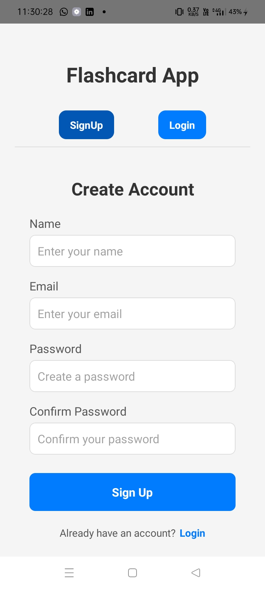
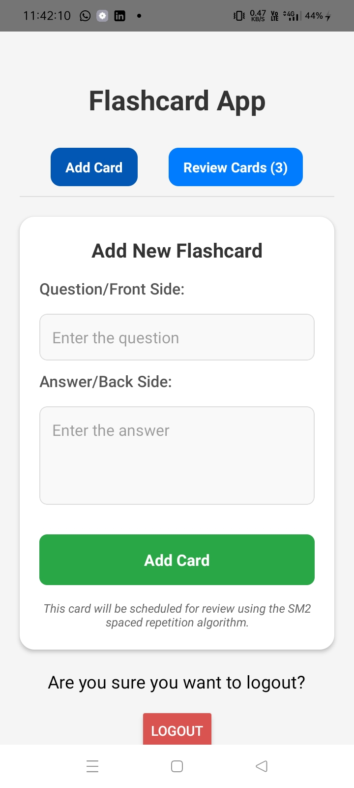
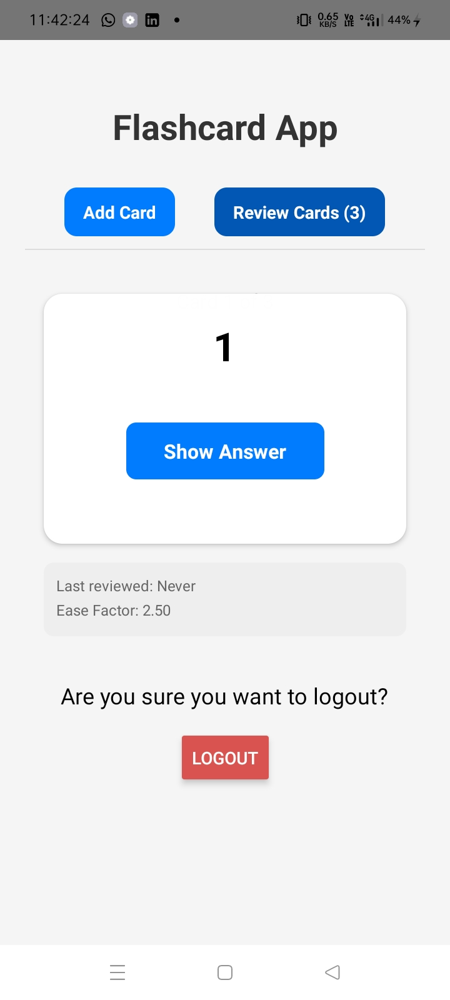
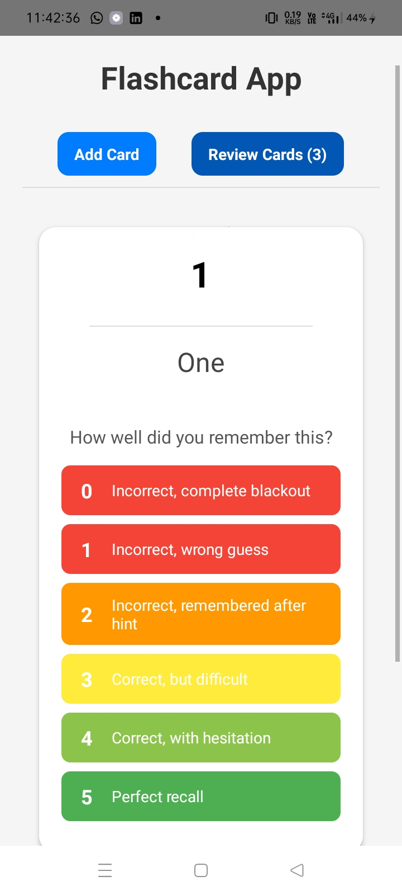
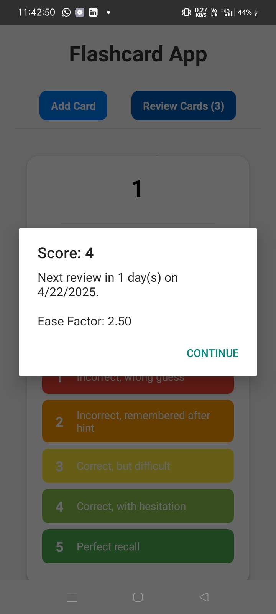

# 🧠 Flashcard App — Spaced Repetition Learning System

Welcome to the **Flashcard App**, a smart learning companion powered by the **SM2 Algorithm** for spaced repetition. It helps you **remember things longer** with fewer reviews by showing the right card at the right time.

---

## 🔐 Authentication

### 🔵 1. Login Screen

- Enter your credentials to access your account.
- Includes **Login** and **Signup** buttons.

---

### 🟢 2. Signup Screen

- Create a new account with your name, email, and password.
- Easily switch back to Login.

---

## 🗂️ Flashcards Dashboard

### 🟡 3. Dashboard Screen

- Add new flashcards.
- See how many cards are due for **review today**.
- **Logout** anytime with the top button.

---

## 📝 Card Review Mode

### 🟣 4. Flashcard Review Screen

- Review your flashcards one by one.
- Each card presents a **question**. Tap to reveal the **answer**.

---

## 🧠 Rate Your Recall Strength

### 🟤 5. Feedback Options for SM2 Algorithm

Choose how well you remembered the flashcard:

| Score | Description                           | What It Tells the System                                    |
|-------|---------------------------------------|-------------------------------------------------------------|
| 5     | Perfect recall                        | You remembered instantly and confidently.                   |
| 4     | Correct, but with hesitation          | You got it right, but it took a moment.                     |
| 3     | Correct, but difficult                | You struggled or were unsure, but got it right.             |
| 2     | Incorrect, remembered after the hint  | You missed it at first, but recalled with help.             |
| 1     | Incorrect, wrong guess                | You did not recall the answer correctly.                    |

This helps the app decide **when to show the card again** for optimal memory retention.

---

## 📊 Score Summary

### ⚪ 6. Session Summary Screen

- See how well you did after reviewing all cards.
- Get a breakdown of your performance by scores.

---

## 🧪 Tech Stack

- **React Native CLI** (not Expo)
- **MongoDB, Express.js, Node.js (MERN)**
- **JWT Authentication**
- **SM2 Spaced Repetition Algorithm**

---

## 📌 Features

- ✅ User Authentication (Signup/Login)
- ✅ Create, Edit, and Delete Flashcards
- ✅ SM2 Review System with Scoring
- ✅ Session Summary for self-analysis
- ✅ Works on both Android and iOS

---

## 🚀 Future Improvements

- 📅 Daily reminders for review
- 📊 Graph-based progress tracking
- 🎙️ Voice-based flashcard support
- 🧑‍🤝‍🧑 Share decks with friends

## 🧠 Learn Smarter, Not Harder.

Thanks for checking out the Flashcard App! Start mastering your memory today 🎓💡
